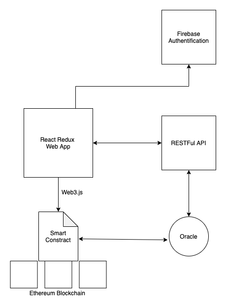

# Blockchain Partner Test

On cherche ici à développer un site de pari sportifs. Il y a deux aspects importants pour convaincre des clients : la possibilité de parier sur des événements qui vont se dérouler et la possibilité de parier sur des événements en direct. Il faut donc être en capacité constante de calculer des cotes à proposer aux clients ainsi que récupérer le résultat des événements en temps réel de manière sécurisée. Tous les clients doivent avoir passé un KYC fort : soumettre son passeport et un justificatif de domicile pour prouver leur identité. En plus de cela, le site fait partie d’un système d’oracles sur la blockchain Ethereum. Cela signifie qu’à la fin de chaque événement, le site vient pousser le résultat de l’événement sur un smart contract déployé sur une chaîne Ethereum.

On cherche donc à décrire une architecture qui implémenterait la description ci-dessus. A l’aide de schémas, de code ou d’explications textuelles on cherche à décrire les différentes interactions entre chaque brique ainsi qu’une façon d’implémenter chaque fonctionnalité (quel langage, quel librairie) en motivant le choix en tenant compte à la fois du contexte mais aussi des compétences/connaissances de l’architecte (une technologie hyper adaptée mais inconnue n’est pas forcément le meilleur choix).

# Architecture proposée

Notre architecture est composée des éléments suivants :

1. Un Frontend avec Recat pour l'affichage des écrans et la navigation entres les écrans. Redux pour la gestion des états et leurs propagation entre les écrans et thunk pour faire des appels API en mode async
2. L'authentification, la connexion et la souscription des utilisateurs seront gérées par Firabase.
3. Les côtes et les compétions seront retournées par des appels RESTFul API à partir d’un service de distribution de paris sportifs.
4. Un smart contract dans la Blockchain Ethereum qui permets de distribuer automatiquement les fonds collectés pour un pari sur les gagnants.
5. un oracle  qui observe les événements Smart Contract. Lorsque le contrat émet un type d'événement spécial avec une définition de demande, le service Oracle demande les données à une API externe.  Une réponse est ensuite injectée par le service Oracle dans le contrat intelligent à l'aide de l'une de ses méthodes.

# Authentification et KYC Process

L'authentification, la connexion et l'inscription de nouveaux utilisateurs et faite par Firebase. 

Après l’inscription d’un nouvel utilisateur, celui-ci est routé vers un écran pour uploader ces documents d’identité pour validation. Après la validation de ces documents par les admins de l’application, cet utilisateur est topé comme validé dans la tables des utilisateur dans le filestore de Firebase.

En fonction de ce top l’application REACT peut router ou non l’utilisateur vers les écrans des paris.   

# Smart Contract

Un pseudo code du smart contract est présent dans le répertoire `eth-contracts/build/contracts` avec des commenatires qui décrivent la logique du contrat intelligent. 

Le fonctionnement général du contrat est le suivant:
- L’utilisateur place un paris en utilisant la méthode `join` (en cliquant sur un bouton dans le front end)
- La fonction `resolve` lance le tirage au sort d'un match par l'émission d'un événement HTTPRequest.
- L’oracle observe l'événement et envoie la demande à l'API pour déterminer le gagnant.
- L’Oracle appelle la méthode `distributionPrize`  du contrat pour distribuer les récompenses.

# Oracle

On peut utiliser `Oraclize.it` fournit une solution prête à l'emploi avec des fonctions et des requêtes qui peuvent être utilisée pour envoyer une demande et recevoir la réponse à la requête de pas notre contrat.

# Utilisation 

